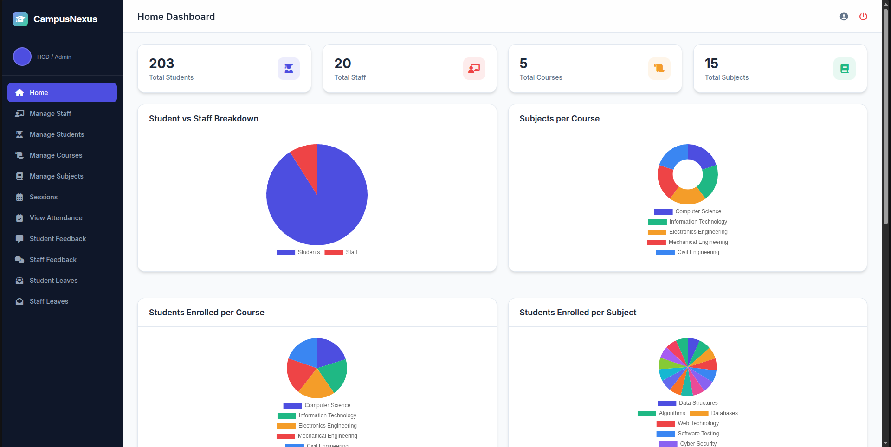
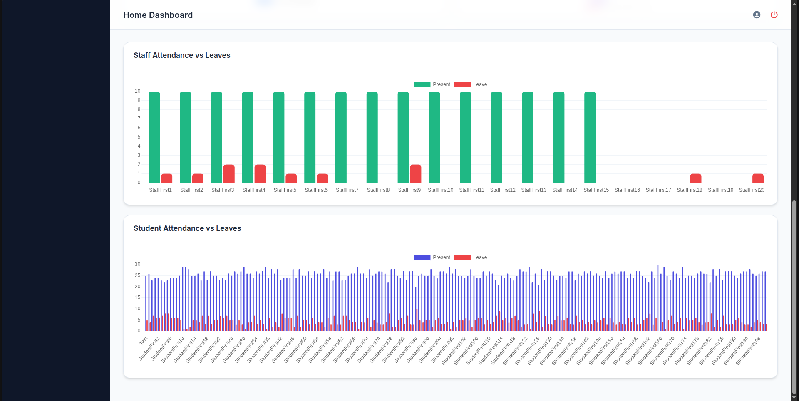
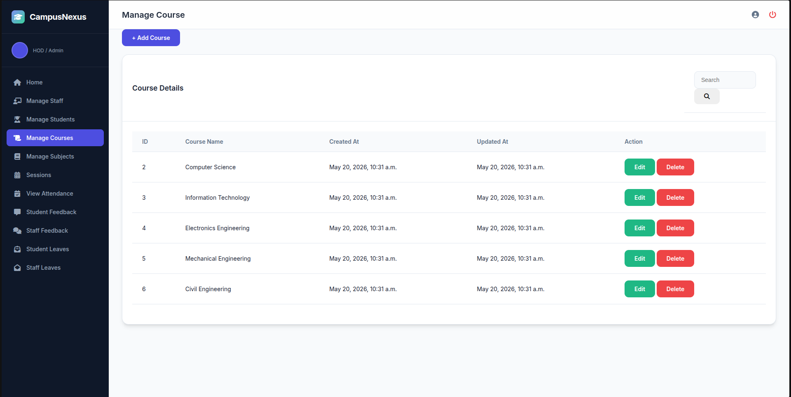
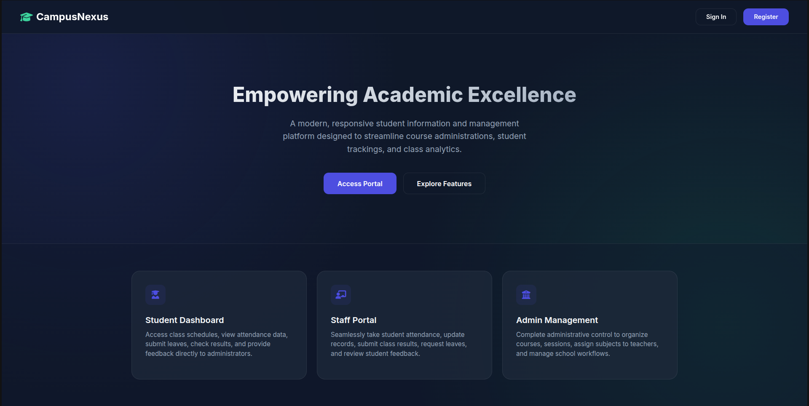
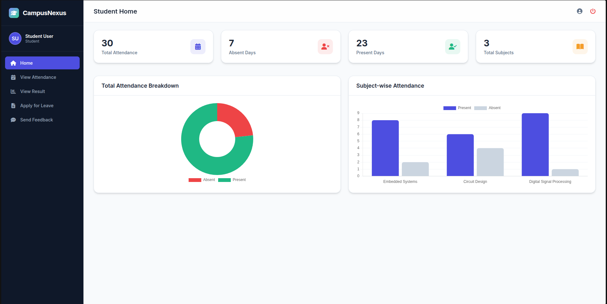
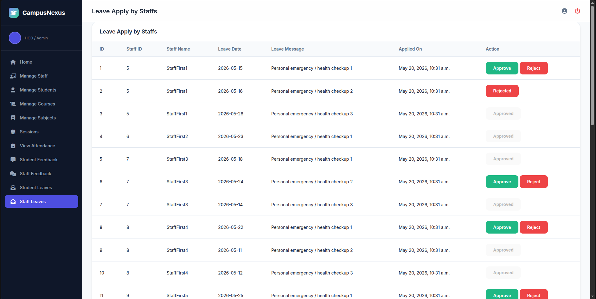

# CampusNexus


> **CampusNexus** is a centralized administrative platform and student management system designed for educational institutions to streamline student databases, courses, daily attendance tracking, academic results, and leaves management.

---

## Work Proof & UI Previews

Below are the screenshots showcasing the modern glassmorphism UI designed for CampusNexus:

### 1. Landing Page
Central portal introducing the platforms of CampusNexus.


### 2. Login Page
Secure authentication gate supporting HOD, Staff, and Student portals.


### 3. Student Registration Page
Email-based role division (`.student@` or `.staff@`) signup.


### 4. Admin (HOD) Dashboard
Complete overview showing enrollments, attendance, and analytics charts powered by Chart.js.


### 5. Staff Dashboard
Class monitoring, subject assignments, and student attendance graphs.


### 6. Student Dashboard
View daily attendance, marks distribution, and leave requests.


---

## Login Credentials (Local Seeding)

The local SQLite database has been pre-seeded with the following testing credentials:

### HOD / Super Admin
* **Email:** `admin@example.com`
* **Password:** `adminpassword123`
* **Role:** Administrator

### Student User
* **Email:** `student@example.com`
* **Password:** `studentpassword123`
* **Role:** Student (assigned to Computer Science)

---

## Tech Stack
* **Backend:** Python 3.12, Django 5.0+
* **Frontend:** Vanilla HTML5, Custom CSS (`dashboard.css`), CDN Chart.js
* **Database:** SQLite (development / default)

---

## Quick Start Guide

### Prerequisites
* Python 3.10+
* Virtual Environment wrapper (`venv`)

### Installation & Run

1. **Activate the Virtual Environment**
   ```bash
   source venv/bin/activate
   ```

2. **Run Migrations & Automatic Schema Generation**
   Generate files and prepare the database structure:
   ```bash
   python manage.py makemigrations
   python manage.py migrate
   ```

3. **Automatically Seed Schema & Fake Data**
   Populate the database with Courses, Subjects, 20 Staff, 200 Students, Attendance logs, and Leave reports automatically:
   ```bash
   python manage.py seed_db
   ```

4. **Verify via Tests**
   ```bash
   python manage.py test
   ```

5. **Start the Development Server**
   ```bash
   python manage.py runserver 0.0.0.0:8000
   ```
   Open your browser and navigate to `http://localhost:8000/`.


---

## Security & Roles
* **Role-Based Redirection:** Automatic landing destination based on custom user types (`1` for HOD, `2` for Staff, `3` for Student).
* **Signal Integration:** Safe profile instantiation via Django `post_save` handlers, preventing duplicate key errors.
* **Responsive Styling:** Designed without external frame dependencies, securing table boundaries and element formatting across mobile, tablet, and widescreen viewports.
